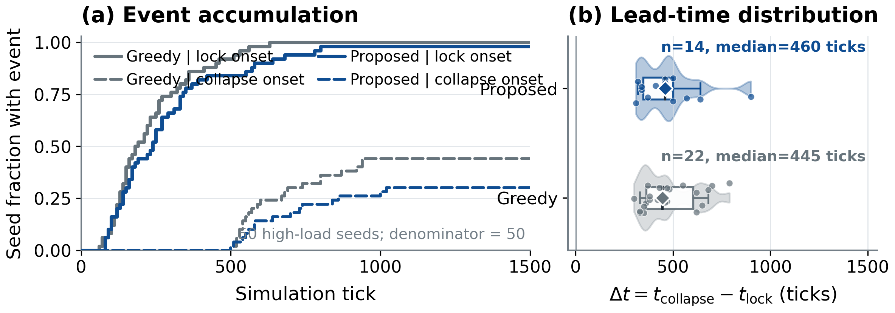

# Congestion-Robust RMFS Dispatch — Reproducibility Artifact

Anonymous review artifact for a robotic mobile fulfillment system (RMFS) dispatcher that evaluates candidate robot assignments with a horizon-separated, action-conditioned world model. The repository connects every reported claim to a frozen protocol, per-seed evidence, analysis code, and a reproduction command.

## Results at a glance

The following committed figures render directly on GitHub and anonymous repository mirrors; no download, notebook, or JavaScript execution is required.


Exact values and machine-readable files are linked from the [result tables](artifacts/tables/README.md).

## Fixed-four-station scale transfer

The frozen policy is also evaluated on 20×20, 30×30, and 40×40 maps at three
robot densities. This is zero-shot graph/fleet-scale transfer with four
stations fixed, not station-count generalization.


The [complete scale-transfer result](docs/results/density_scale_results.md)
also shows all 27 load × density × map-size cells and the paired bootstrap
analysis.

## Station-lock mechanism



## Runtime benchmark


The [runtime results](docs/results/runtime_results.md) report the paired CPU/GPU
analysis, latency-driver fit, hardware record, and supplementary episode-time
figure.

## Start here

The repository is intentionally layered:

- [Artifact overview](docs/artifact_overview.md) explains what is and is not included.
- [Claims to artifacts](docs/claims_to_artifacts.md) maps paper claims to data and commands.
- [Result tables](artifacts/tables/README.md) render the principal figures and exact summary values directly in the repository.
- [Quick start](docs/quickstart.md) gives copy-and-paste reproduction commands.
- [Training pipeline and seed splits](docs/reproduction/training_pipeline.md) details dataset construction, two-stage WM training, J1, six-station adaptation, and training-data availability.
- [Simulator source guide](docs/simulator/source_guide.md) maps the paper's execution path, one-tick transition, state ownership, policy injection, and metric collection to the exact files under `src/`.
- [Experiment protocol](docs/experiments/main_protocol.md) records the frozen 50-seed PP evaluation.
- [Method and schemas](docs/method/state_action_labels.md) define every state, action, and label channel.
- [Mechanism analysis](docs/mechanisms/temporal_precedence.md) separates the endpoint collapse label from temporal onset localization.

The implementation retains its original import contracts under `src/Engine`, `src/Policies`, `src/WorldModel`, and related top-level packages. This is deliberate: rewriting them as a single package would change the evaluated code path.

## Minimal reproduction

Python 3.10 is the reference interpreter.

```bash
python -m venv .venv
source .venv/bin/activate
python -m pip install -r requirements-artifact.txt
python scripts/reproduce_tables.py
python scripts/reproduce_figures.py --figure all
python scripts/reproduce_density_scale.py
python scripts/verify_artifacts.py
```

Windows PowerShell activation is `.venv\Scripts\Activate.ps1`. Generated outputs are written to `artifacts/generated/`; committed paper outputs under `artifacts/` are never silently overwritten.

## Three reproduction levels

1. **Statistics-only (minutes, no checkpoint):** regenerate tables, paired bootstrap confidence intervals, and Figs. 5/6/6s from committed compact evidence with `make reproduce`.
2. **Smoke simulation (minutes to tens of minutes):** install `requirements.txt`, then run `make smoke-sim` to exercise the real simulator and baseline dispatch path on a short configuration.
3. **Full campaign (compute intensive):** obtain checkpoints through [the checkpoint manifest](checkpoints/README.md), then follow [the full experiment guide](docs/reproduction/full_experiment.md). The main campaign contains 3 loads × 50 seeds × 5 arms = 750 simulations of 1,500 ticks.

## Repository map

```text
README/docs        navigation and complete protocol documentation
configs/schemas    machine-readable experiment and tensor contracts
src                evaluated simulator, policies, planners, and WM implementation
manifests           paired arrival streams and compact metadata
artifacts           per-seed rows, statistics, tables, and paper figures
scripts/tests       deterministic reproduction and verification
checkpoints         metadata only; model binaries are distributed separately
runtime             measurement protocol and frozen timing observations
```

Run `make help` for individual claims such as `make table-main`, `make paired-ci`, `make fig05`, `make fig06`, `make station6`, `make density-scale`, and `make result-plots`. All documentation remains ordinary Markdown so it renders directly in repository and anonymous-mirror views.

## Review anonymity and provenance

This snapshot intentionally contains no author names, personal e-mail addresses, workstation paths, or public source-repository owner. `CITATION.cff` uses an anonymous placeholder during double-blind review and must be updated after acceptance. Third-party MAPF solver source and large training outputs are not vendored; their status is documented in [artifact overview](docs/artifact_overview.md).

## License and citation

Code is released under the [Apache License 2.0](LICENSE). During review, cite the anonymous paper title given in [CITATION.cff](CITATION.cff); replace the placeholder author metadata only after the review process permits it.
