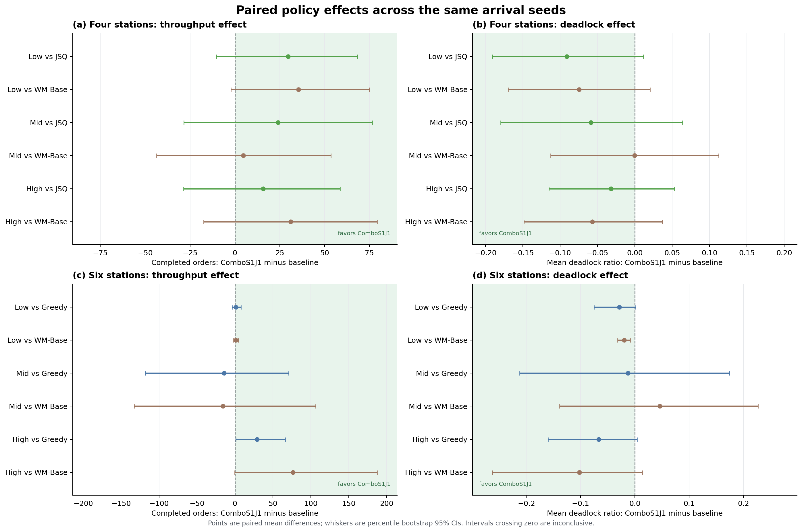
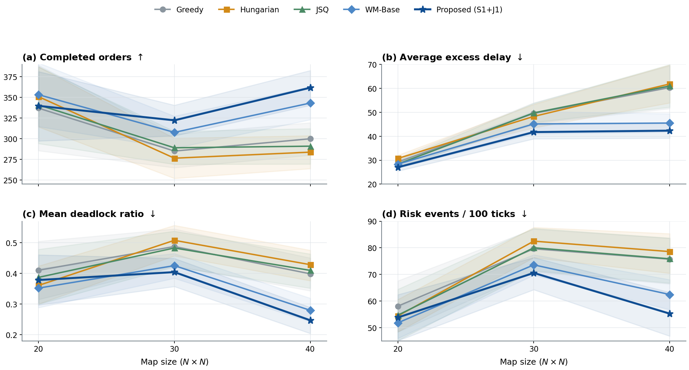
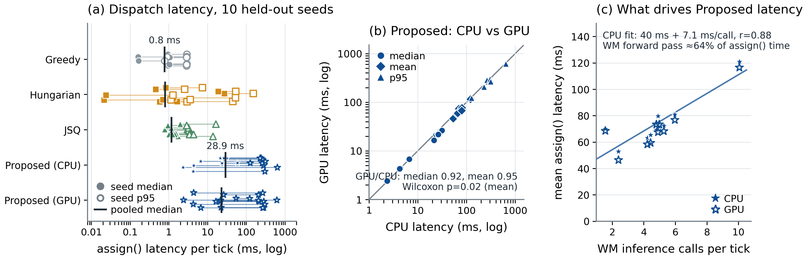
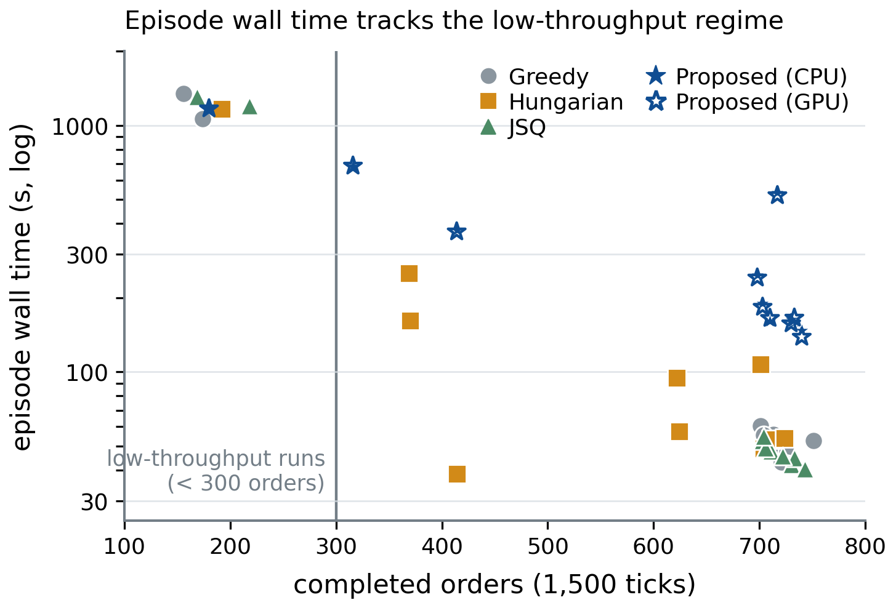
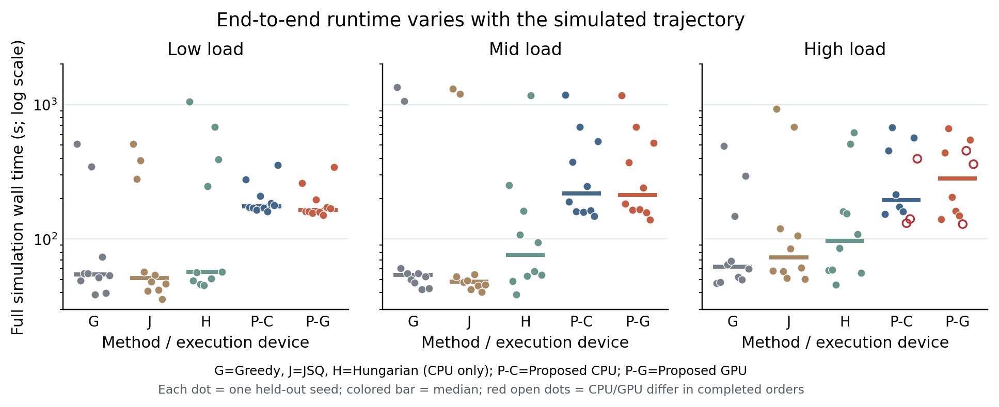

# Result tables

These figures and tables render directly on the GitHub file page. No local
download, notebook, or JavaScript is needed.

## Main four-station evaluation

Mean completed orders over 50 paired seeds, after 1,500 simulation ticks:

| Load | Greedy | Hungarian | JSQ | WM-Base | ComboS1J1 |
|---|---:|---:|---:|---:|---:|
| Low | 356.42 | 341.14 | 350.84 | 345.14 | **380.56** |
| Mid | 358.30 | 325.36 | 337.52 | 356.90 | **361.56** |
| High | 318.36 | 290.44 | 367.74 | 352.28 | **383.42** |

## Six-station adaptation

Mean completed orders over 10 held-out seeds:

| Load | Greedy | Hungarian | WM-Base | ComboS1J1 |
|---|---:|---:|---:|---:|
| Low | 640.9 | 518.1 | 640.7 | **642.1** |
| Mid | 608.5 | 543.1 | **609.8** | 594.1 |
| High | 667.4 | 504.9 | 620.0 | **696.6** |

## Fixed-four-station map/fleet scale transfer

The frozen model and policy are evaluated without retraining across three map
sizes, three proportional robot densities, three loads, and ten seeds.

| Map | Greedy | Hungarian | JSQ | WM-Base | Proposed |
|---:|---:|---:|---:|---:|---:|
| 20×20 | 337.1 | 351.0 | 341.0 | 353.4 | 339.8 |
| 30×30 | 285.1 | 276.4 | 289.0 | 307.7 | **322.3** |
| 40×40 | 299.9 | 283.7 | 291.0 | 343.2 | **361.8** |

Values pool three densities × three loads × ten seeds (n=90 per policy and
map). The figure bands use stratified load–seed cluster-bootstrap 95%
intervals. Proposed − JSQ is +34.31 completed orders overall, with 95% CI
[20.12, 49.03].

The exact summaries are in `table_density_scale.csv` and
`table_density_scale_cells.csv`; paired effects and Pareto membership are in
the adjacent `statistics/` directory.

## Runtime benchmark

The dedicated six-station mid-load benchmark measures every `assign()` call
over ten paired held-out seeds (15,000 calls per configuration).

| Configuration | Median (ms) | Mean (ms) | p95 (ms) | Maximum (ms) |
|---|---:|---:|---:|---:|
| Greedy | 0.8 | 1.0 | 2.8 | 6.9 |
| JSQ | 1.2 | 2.1 | 8.3 | 20.0 |
| Hungarian | 0.8 | 9.4 | 52.6 | 203.8 |
| Proposed (CPU) | 28.9 | 74.5 | 307.8 | 6,217.2 |
| Proposed (GPU) | 23.0 | 70.8 | 297.1 | 7,510.6 |

The second figure is descriptive: its 300-order line marks low throughput,
not the paper's joint completed-orders/deadlock collapse label. Full
interpretation and paired device statistics are in the
[runtime result](../../docs/results/runtime_results.md).

### Cross-load runtime audit

The extended benchmark covers low, mid, and high load with the same ten
held-out seeds.

| Load | Greedy CPU | JSQ CPU | Hungarian CPU | Proposed CPU | Proposed GPU |
|---|---:|---:|---:|---:|---:|
| Low | 0.83 | 2.80 | 6.36 | 86.86 | 79.32 |
| Mid | 1.02 | 2.05 | 9.37 | 74.49 | 70.79 |
| High | 1.33 | 4.65 | 18.15 | 71.12 | 64.01 |

Values are pooled mean `assign()` milliseconds per tick (15,000 calls per
cell). The CPU/GPU differences are closed-loop observations, not strict
same-state inference speedups.

Red open points identify high-load seeds where Proposed CPU and GPU finish
different numbers of orders. Whole-run time is descriptive because the
dispatcher changes the subsequent simulated trajectory.

Bold marks the largest mean in each row and is descriptive, not a claim of
statistical significance. The paired-effect figure above reports the paired
bootstrap 95% confidence intervals used for inference.

All tables are regenerated from per-seed evidence with `make reproduce`.
The static summaries are regenerated with `make result-plots`; maintainers use
`python scripts/generate_results_overview.py --freeze` only when intentionally
refreshing the committed copies.
