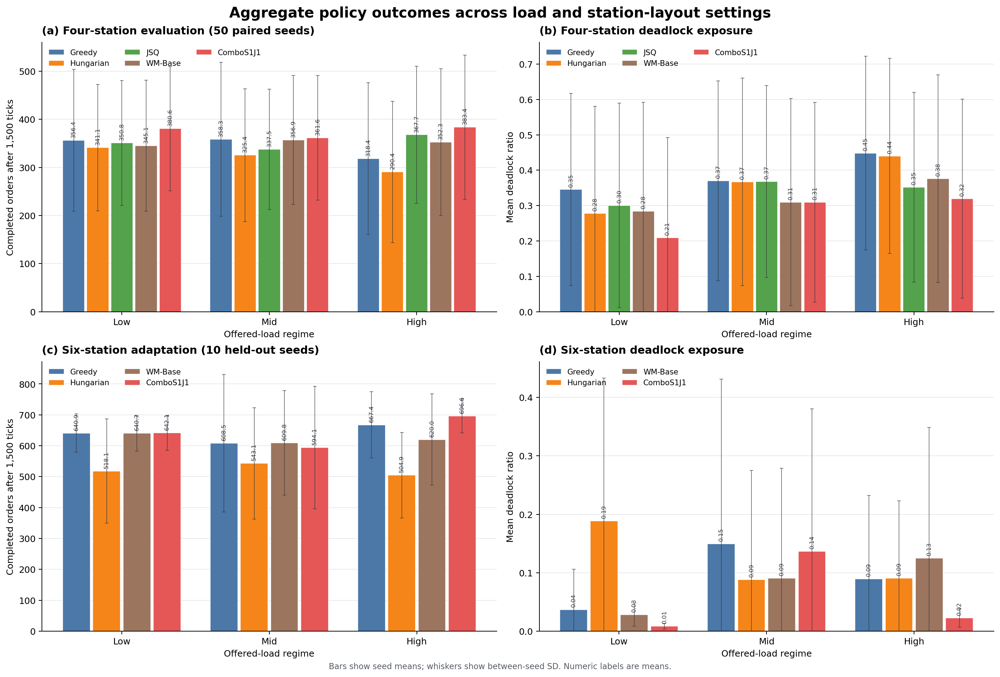

# RMFS world-model artifact

This site is the detailed companion to the anonymous paper **“Congestion-Robust RMFS Dispatch via a Horizon-Separated Action-Conditioned World Model.”** It is organized as an evidence graph, not as a second paper.

Use [Claims to artifacts](claims_to_artifacts.md) to move directly from a paper statement to its frozen evidence and reproduction command. The result figures below render directly in repository and anonymous-mirror views. Use [Quick start](quickstart.md) for the lightweight reproduction path, which does not require model checkpoints or a simulator rerun.

The main PP evaluation fixes 50 seeds (900–949), three offered-load definitions, five dispatch arms, 1,500 ticks, and exact per-cell arrival-manifest replay. The six-station experiment is a seed-disjoint adaptation study, not a zero-shot claim. The mechanism analysis uses the paper’s joint completed-orders/deadlock endpoint definition before localizing a collapse time from an independent completion-rate-plus-backlog trace.

!!! note "Double-blind snapshot"
    Author identities, personal paths, repository-owner URLs, and large binary assets are intentionally absent. The anonymous citation metadata should be replaced after review.
