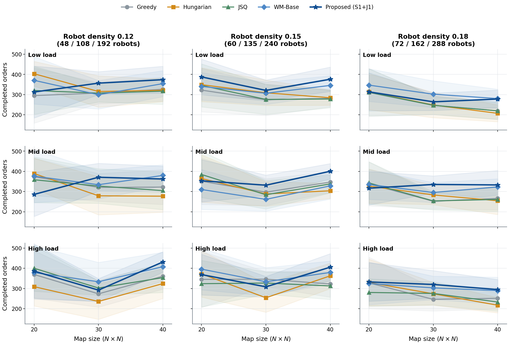

# Fixed-four-station scale transfer

Both committed figures render directly in GitHub and anonymous repository
views. The first exposes all 27 load × density × map-size cells; bands are
ten-seed 95% t intervals.

The second pools the three densities and three loads at each map size. Bands
are stratified load–seed cluster-bootstrap 95% intervals.

Mean completed orders, with 90 runs per policy and map size, are:

| Map | Greedy | Hungarian | JSQ | WM-Base | Proposed |
|---:|---:|---:|---:|---:|---:|
| 20×20 | 337.1 | 351.0 | 341.0 | 353.4 | 339.8 |
| 30×30 | 285.1 | 276.4 | 289.0 | 307.7 | **322.3** |
| 40×40 | 299.9 | 283.7 | 291.0 | 343.2 | **361.8** |

The cluster-paired Proposed − JSQ completed-order effect is +34.31 overall
(95% CI [20.12, 49.03]; 25/30 positive load–seed clusters). Broken down by
map size, it is −1.19 [−32.90, 29.31] at 20×20, +33.26 [10.18, 55.73] at
30×30, and +70.86 [49.21, 92.47] at 40×40. At 40×40, the incremental
Proposed − WM-Base effect is +18.58 [1.48, 36.07]; pooled over all sizes it is
+6.53 [−9.24, 22.66]. Thus, the strongest evidence is transfer to the 30×30
and 40×40 settings, while the incremental S1+J1 gain over WM-Base is not
uniformly established.

Relative to JSQ, Proposed changes excess delay, mean deadlock ratio, and risk
events per 100 ticks by −1.34/−0.01/−0.85 at 20×20,
−8.02/−0.08/−9.47 at 30×30, and −18.66/−0.16/−20.61 at 40×40. Proposed has
the highest mean completed orders in 15 of 27 cells and belongs to the
four-endpoint Pareto set in 25 of 27 cells.

The 20×20 ten-seed subset is visibly heterogeneous and does not replace the
separate 50-seed main experiment. Nor should the non-monotone raw throughput
across map sizes be interpreted as a capacity law: map geometry, fleet size,
and congestion jointly change. The supported claim is robust zero-shot
graph/fleet-scale transfer under the fixed four-station interface.

Run `make density-scale` to regenerate the tables, paired effects, Pareto
membership, and both figures from all 1,350 committed run-level rows.
