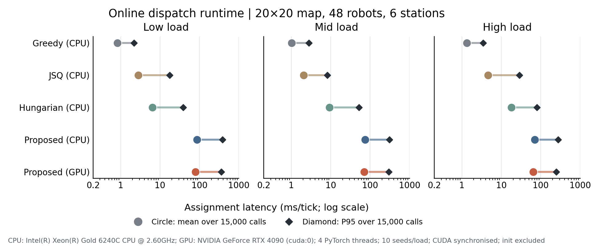

# Runtime benchmark

The dedicated runtime benchmark uses the six-station 20×20 adaptation on the
ten held-out seeds 721–730. It covers low, mid, and high load; every
configuration replays the same arrival manifest within a `(load, seed)` cell
and runs for 1,500 ticks. Analytic baselines run on CPU; the proposed
dispatcher is measured once on CPU and once with its neural components on one
RTX 4090. The paper's main Fig. 6 focuses on the mid-load slice, while the
cross-load figures below expose all three loads.


**Fig. 6.** (a) Steady-state wall latency around every `assign()` call. Each
line joins one seed's median (filled marker) to its p95 (hollow marker); the
dark vertical tick is the median pooled over all 15,000 calls for that
configuration. (b) Paired CPU and GPU measurements for the proposed
dispatcher. (c) Mean assignment latency versus the number of World-Model
inference calls made per tick.

## Assignment latency

The pooled latency distribution is:

| Configuration | Calls | Median (ms) | Mean (ms) | p95 (ms) | Maximum (ms) |
|---|---:|---:|---:|---:|---:|
| Greedy | 15,000 | 0.8 | 1.0 | 2.8 | 6.9 |
| JSQ | 15,000 | 1.2 | 2.1 | 8.3 | 20.0 |
| Hungarian | 15,000 | 0.8 | 9.4 | 52.6 | 203.8 |
| Proposed (CPU) | 15,000 | 28.9 | 74.5 | 307.8 | 6,217.2 |
| Proposed (GPU) | 15,000 | 23.0 | 70.8 | 297.1 | 7,510.6 |

Median latency alone hides the Hungarian tail: its pooled median is almost the
same as Greedy, but its p95 is 52.6 ms and its mean rises to 9.4 ms.

## Cross-load assignment cost



**Cross-load runtime audit.** Circles show the mean and diamonds the p95 over
15,000 synchronized `assign()` calls for each method and load. Initialization
is excluded. The exact pooled values are:

| Load | Greedy CPU | JSQ CPU | Hungarian CPU | Proposed CPU | Proposed GPU |
|---|---:|---:|---:|---:|---:|
| Low | 0.83 | 2.80 | 6.36 | 86.86 | 79.32 |
| Mid | 1.02 | 2.05 | 9.37 | 74.49 | 70.79 |
| High | 1.33 | 4.65 | 18.15 | 71.12 | 64.01 |

Values are mean milliseconds per tick, including ticks on which no new task is
assigned. They are neither isolated neural-forward latency nor end-to-end
system response time. Across all loads, Proposed is substantially more
expensive than the three analytic baselines. Hungarian again has a pronounced
tail: its p95 rises from 38.2 ms at low load to 80.2 ms at high load even
though its pooled means are 6.4–18.1 ms.

The Proposed-GPU mean is 8.7%, 5.0%, and 10.0% below Proposed-CPU at low, mid,
and high load. These are observed assignment-cost differences between two
closed-loop executions, not a controlled same-state GPU inference speedup.

## CPU versus GPU

For the proposed dispatcher, seed-paired GPU/CPU ratios are 0.92 for median
latency, 0.95 for mean latency, and 0.97 for p95 latency. The two-sided paired
Wilcoxon p-values are 0.084, 0.020, and 0.232, respectively. The corresponding
whole-episode wall-time ratio is 0.98 (`p=0.064`). Only the mean assignment
latency comparison reaches `p<0.05`; the benchmark therefore does not support
a practically large device-placement speedup.

The stronger runtime driver is how often the policy invokes the World Model.
Across the ten CPU runs,

```text
mean assign latency ≈ 39.9 ms + 7.1 ms × WM inference calls per tick
Pearson r = 0.88, p = 0.00069
```

The policy's internal timer attributes a median 64.1% of total assignment time
to World-Model forward passes on CPU (64.6% on GPU). These observations point
to reducing the number of scored candidates—through a smaller top-M set or
candidate pruning—as the clearest optimization direction. They do not imply
that the remaining time is hardware independent or that the fitted line will
transfer unchanged to another machine.

## Episode wall time


**Fig. 6s (supplementary).** End-to-end episode wall time against completed
orders. Runs below 300 completed orders form a 1,063–1,346 s cluster shared by
Greedy, JSQ, Hungarian, and Proposed. This panel deliberately labels that
region **low throughput**, rather than applying the paper's formal collapse
label: the runtime extract contains completed orders but not the mean-deadlock
component required by the joint collapse definition.

Outside the below-300 group, Proposed takes 139–686 s per episode (CPU median
190 s; GPU median 183 s), while the analytic baselines take 39–252 s. Whole-run
wall time mixes simulator dynamics, dispatch, path planning, operating-system
scheduling, and the amount of work performed. It should not be read as a
hardware-independent speedup or as a substitute for the per-call benchmark.

The corresponding three-load view makes the trajectory dependence explicit:


Each point is one seed and each horizontal bar is the within-method median.
The red open points identify high-load Proposed CPU/GPU runs whose completed
order counts differ: seeds 727, 728, and 730. Seed 728 is the largest mismatch
(765 orders on CPU versus 551 on GPU). Low and mid load have no completed-order
mismatch, but equal final counts still do not establish tick-by-tick state or
decision equivalence.

At high load, Proposed-GPU has lower mean assignment cost but *higher* mean
whole-run wall time than Proposed-CPU (325.1 s versus 306.7 s). This is a
direct example of why the assignment-cost ratios cannot be promoted to an
end-to-end speedup claim: dispatch choices change motion, congestion, the
number of completed tasks, and subsequent decision contexts.

Every value plotted above is retained in
`artifacts/raw/figure_inputs/fig06_runtime_benchmark_runs.csv`,
`fig06_runtime_benchmark_pooled.csv`, and
`fig06_runtime_benchmark_stats.json`. The cross-load inputs are
`station6_runtime_chart_summary.csv` and the three
`*_all_seeds_cpu_gpu_runs.csv` files in the same directory. The collection JSON is not committed
because its audit metadata contains machine-specific absolute paths and static
file fingerprints; no measured or plotted value depends on those fields.

Regenerate both figures with:

```bash
python scripts/generate_fig06_runtime.py
python scripts/generate_station6_runtime_crossload.py
```

Generated PDF/PNG files are written under `artifacts/generated/fig06`; the
committed paper copies remain under `artifacts/figures`.
