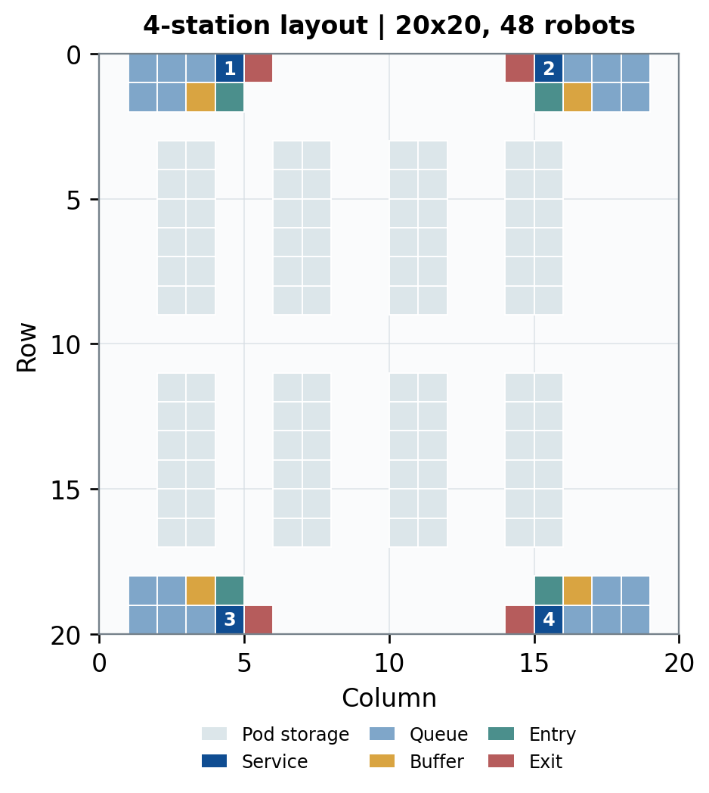
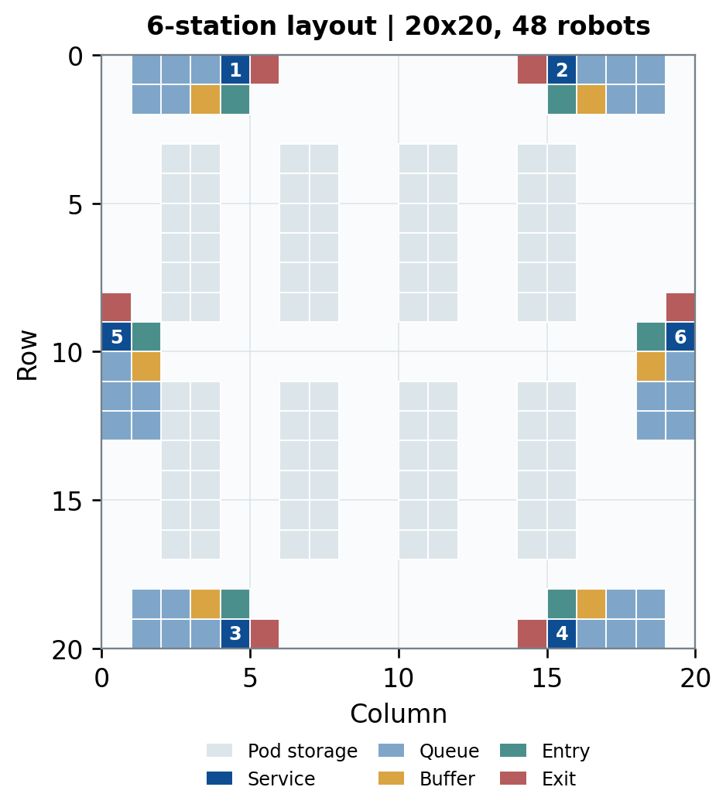

# Simulation environment

The reported main layout is a 20×20 grid with 48 robots, eight 6×2 pod zones, and four stations. The adaptation layout keeps the grid, robot count, pod zones, workloads, task lifecycle, PP parameters, and station-zone capacity fixed while adding two lateral stations.

Each station has one service slot, five queue slots, one buffer slot, an entry cell, and an exit cell. Physical occupancy capacity is therefore seven; the entry cell is not counted as a queue-zone slot. Robots move at most one grid edge per tick.

Exact coordinates live in `configs/simulator/*.json`; concise layout contracts live in `configs/maps`, and rendering-ready map JSON lives in `maps/`.

| Main four-station layout | Six-station adaptation layout |
|---|---|
|  |  |

Both previews are rendered directly from the committed map JSON with
`python scripts/generate_map_previews.py`.
